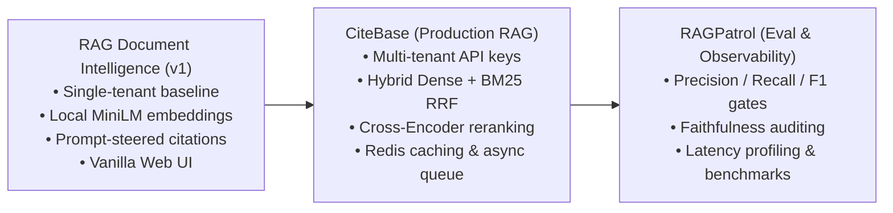
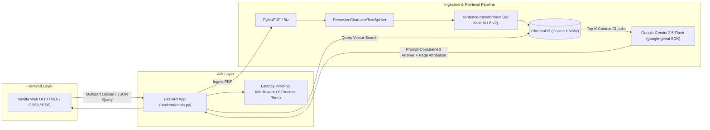

# RAG Document Intelligence (v1 Foundation)

> Single-tenant baseline document intelligence system pairing local MiniLM semantic embeddings with prompt-constrained Gemini 2.5 Flash generation and page-level attribution.

[](LICENSE)
[](https://www.python.org/)
[](https://fastapi.tiangolo.com/)
[](https://www.trychroma.com/)
[](https://ai.google.dev/)
[](https://pymupdf.readthedocs.io/)
[](https://github.com/GurutejaReddy-04/rag-document-intelligence/actions)

---

## Portfolio Context & Relationship to CiteBase

This repository serves as the **v1 Foundation** in an engineering progression toward production-grade document intelligence and evaluation:



### Architectural Evolution
- **What this project established:**
  - End-to-end single-tenant RAG loop pairing local embeddings with cloud LLM generation.
  - Local CPU embedding vectorization (`sentence-transformers/all-MiniLM-L6-v2`) eliminating per-query embedding API costs and latency.
  - Persistent ChromaDB collection partitioning per document/topic.
  - Prompt-steered page-level attribution (`[Page N | file]`) using Gemini 2.5 Flash.
  - Lightweight zero-dependency vanilla web frontend.
- **Limitations of the v1 architecture addressed in [CiteBase](https://github.com/GurutejaReddy-04/citebase):**
  - *Logical Collections $\to$ Cryptographic Multi-Tenancy:* v1 relies on unauthenticated endpoints with user-supplied collection names. CiteBase introduces SHA-256 API key hashing, tenant-isolated vector namespaces (`t_{tenant_id}_{collection}`), and PostgreSQL relational boundaries.
  - *Dense-Only Retrieval $\to$ Hybrid Dense + BM25Okapi Search:* v1 uses dense cosine similarity exclusively, creating blind spots for exact lexical matches (part numbers, technical codes, product acronyms). CiteBase fuses dense vectors with BM25Okapi sparse search via Reciprocal Rank Fusion (RRF, $k=60$).
  - *Top-K Distractor Noise $\to$ Cross-Encoder Passage Reranking:* v1 feeds all top-$K$ chunks directly to the generator regardless of distance drift. CiteBase scores passages with `cross-encoder/ms-marco-MiniLM-L-6-v2` and applies a relevance cutoff threshold.
  - *Request-Path Blocking Ingestion $\to$ Asynchronous Ingestion & Task Polling:* v1 blocks during PDF parsing and embedding inside the HTTP request loop. CiteBase processes documents via `BackgroundTasks` with HTTP 202 Accepted and task state polling.
  - *Redundant LLM Invocations $\to$ Tenant-Scoped Redis Caching:* v1 hits the LLM on every query. CiteBase caches responses in Redis with tenant TTL, delivering up to 349x speedup on cache hits.
  - *Hard Retrieval Misses $\to$ Web Search Fallback:* v1 returns a fixed fallback string when context is absent. CiteBase falls back to DuckDuckGo/Tavily with unified reranking.
- **Common Primitives Retained Across Both:**
  - PyMuPDF text extraction.
  - `all-MiniLM-L6-v2` dense embedding representation.
  - Gemini Flash generation.
  - Bracketed page-level citation format.

---

## The Grounding Triad

To maintain technical credibility, this project explicitly distinguishes between three independent layers of a RAG pipeline:

```text
Layer 1: Retrieval Relevance
   Query -> all-MiniLM-L6-v2 -> Chroma HNSW -> Top-K Chunks + Cosine Distance
   [Distance Metric != Calibrated Confidence Probability]

Layer 2: Prompt Constraints
   system_instruction -> Temperature 0.2 -> Gemini 2.5 Flash
   [Control / Steering Mechanism != Mathematical Guarantee]

Layer 3: Citation Attribution
   Injected [Page N | file] -> LLM generates bracketed citations
   [Attribution Flow != Deterministic Entailment Verification]
```

1. **Retrieval Relevance $\neq$ Correctness:** ChromaDB returns cosine distance ($0$ to $2$). The frontend visualizes this as a normalized relevance estimate (`(1 - distance/2) * 100`). This is an uncalibrated geometric distance metric, not a statistical confidence probability.
2. **Prompt Constraints $\neq$ Zero-Hallucination Guarantees:** Context is injected into Gemini 2.5 Flash via `system_instruction` with instructions to decline out-of-context questions at low temperature ($0.2$). This steers the model but does not provide a mathematical guarantee against extrapolation or subtle interpolation.
3. **Citation Attribution $\neq$ Verification:** The pipeline injects chunk metadata (`[Page N | file]`) and instructs the LLM to attribute claims. However, this repository does not include a second-stage claim verifier or NLI entailment model to prove that generated statements strictly follow from the cited text span (for automated evaluation and faithfulness auditing, see [RAGPatrol](https://github.com/GurutejaReddy-04/ragpatrol)).

---

## Architecture & Data Flow



---

## Tech Stack

| Layer | Component | Purpose |
|---|---|---|
| **API Framework** | [FastAPI](https://fastapi.tiangolo.com/) | Asynchronous REST endpoints with Pydantic validation & latency profiling |
| **Frontend UI** | Vanilla HTML5 / CSS3 / JS | Lightweight, dependency-free dual-pane interface |
| **PDF Extraction** | [PyMuPDF (fitz)](https://pymupdf.readthedocs.io/) | Fast, page-by-page text stream extraction |
| **Chunking** | [LangChain Splitters](https://python.langchain.com/) | `RecursiveCharacterTextSplitter` with configurable chunk size and overlap |
| **Embeddings** | [Sentence-Transformers](https://www.sbert.net/) | Local `all-MiniLM-L6-v2` dense vectors (384 dimensions) on CPU |
| **Vector Database** | [ChromaDB](https://www.trychroma.com/) | Persistent vector store using HNSW with cosine distance |
| **LLM Generation** | [Google Gemini 2.5 Flash](https://ai.google.dev/) | Prompt-constrained synthesis via the unified `google-genai` SDK |

---

## Frontend Modernization

The original Streamlit interface was intentionally migrated to a **lightweight, dependency-free vanilla web frontend** (`HTML5`, `CSS3`, `JavaScript`):
- **Decoupled Client:** The frontend runs as a static client in any web browser without requiring a Python-based UI server.
- **Eliminated Reload Overhead:** Avoids full-page Python script re-execution on every widget interaction.
- **Reduced Surface Area:** Removes `streamlit` and `requests` dependencies from production requirements.

---

## Architecture & System Limitations

To demonstrate transparent engineering maturity, the following architectural boundaries and trade-offs are explicitly documented:

- **Document Extraction:** Uses PyMuPDF text stream extraction (`page.get_text()`) with no optical character recognition (OCR). Image-only or scanned PDFs yield empty text.
- **Structural Layout:** Tables, figures, diagrams, multi-column layouts, and mathematical formulas are flattened into linear character sequences without layout reconstruction.
- **Retrieval Bounds:** Uses fixed top-$K$ dense retrieval with no minimum distance score cutoff threshold and no cross-encoder passage reranker. Semantic drift in large corpora can cause distractor chunks to reach the prompt.
- **Generation Bounds:** Prompt instructions and low temperature ($0.2$) steer generation but cannot mathematically guarantee complete factual consistency or immunity to prompt leakage.
- **Citation Bounds:** Page and source metadata are supplied to the LLM, but generated citations are not independently audited against source spans by an automated verification layer.
- **Deployment & Scalability:** Operates against an embedded SQLite-backed ChromaDB client (`PersistentClient`), designed for single-node local execution rather than horizontally scaled multi-worker clusters.
- **Security & Authorization:** The API provides no authentication or authorization layer. The endpoints (`/upload`, `/query`, `/collections`, `DELETE /collections/{name}`, and `POST /reset`) are unprotected. Collection naming provides logical organization only, not security-grade tenant isolation.

---

## Project Structure

```text
.
├── .github/
│   └── workflows/
│       └── ci.yml              # GitHub Actions CI matrix workflow
├── backend/
│   ├── config.py               # Environment configuration & lazy credential validation
│   ├── db.py                   # Thread-safe ChromaDB PersistentClient singleton
│   ├── generator.py            # Gemini prompt assembly & lazy client management
│   ├── ingest.py               # PDF parsing, recursive chunking, and ChromaDB persistence
│   ├── main.py                 # FastAPI application, routes, and latency middleware
│   └── retriever.py            # Semantic similarity search with cosine distance
├── frontend/
│   ├── app.js                  # Vanilla JS API integration & DOM manipulation
│   ├── index.html              # Clean dual-pane application interface
│   └── styles.css              # Responsive custom stylesheet
├── tests/
│   ├── conftest.py             # Shared fixtures, isolated temp storage, mock GenAI client
│   ├── test_api.py             # REST routes, validation regex, and CRUD integration tests
│   ├── test_config.py          # Configuration defaults & missing credential failure tests
│   ├── test_generator.py       # Deterministic fallbacks, prompt assembly, error handling
│   ├── test_ingest.py          # PDF text parsing, chunking, deduplication, force replace
│   └── test_retriever.py       # Top-K semantic retrieval and empty collection behavior
├── .gitignore
├── env.example
├── LICENSE
├── requirements-dev.txt        # Pytest & HTTP test dependencies
├── requirements.txt            # Production runtime dependencies
└── README.md
```

---

## Quick Start

### 1. Prerequisites & Environment Setup

- Python 3.10+
- A Google AI Studio API Key ([Get a Gemini API Key](https://aistudio.google.com/app/apikey))

```bash
# Clone repository
git clone https://github.com/GurutejaReddy-04/rag-document-intelligence.git
cd rag-document-intelligence

# Create and activate virtual environment
python -m venv .venv
source .venv/bin/activate  # On Windows: .venv\Scripts\activate

# Install runtime dependencies
pip install -r requirements.txt

# Configure environment variables
cp env.example .env
```

Edit your `.env` file and supply your Gemini API key:
```ini
GEMINI_API_KEY=your_gemini_api_key_here
GEMINI_MODEL=gemini-2.5-flash
CHROMA_PATH=chroma_db
UPLOAD_DIR=data/uploaded_docs
CHUNK_SIZE=500
CHUNK_OVERLAP=50
TOP_K_RESULTS=5
ALLOWED_ORIGINS=http://localhost:8501,http://localhost:3000
```

---

### 2. Running the Backend API

Launch the FastAPI backend server from the `backend/` directory:

```bash
cd backend
uvicorn main:app --reload --host 0.0.0.0 --port 8000
```

The interactive OpenAPI/Swagger documentation is available at:
- **Swagger UI:** [http://localhost:8000/docs](http://localhost:8000/docs)
- **Health Check:** [http://localhost:8000/health](http://localhost:8000/health)

---

### 3. Running the Frontend

Serve the vanilla frontend with any static file server:

```bash
# In a separate terminal
cd frontend
python -m http.server 8501
```

Access the interface at [http://localhost:8501](http://localhost:8501).

---

## Automated Testing & CI

A complete automated test suite is provided in `tests/`, covering deterministic unit tests, API integration, isolated Chroma state, and configuration failure behavior.

### Clean-Clone Credential-Free Test Execution

The test suite is fully decoupled from live cloud credentials using isolated fixtures and SDK mocking. You can run the entire regression suite without setting a real `GEMINI_API_KEY`:

```bash
# Install test dependencies
pip install -r requirements-dev.txt

# Run full test suite
pytest -v tests/
```

### Tested Scenarios
- **Ingestion:** Page-by-page text loading, blank/image-only PDF handling, malformed/corrupted PDF rejection, recursive chunking with overlap, metadata attribution, deduplication skipping, and `force=True` re-ingestion.
- **Retrieval:** Cosine distance ranking, top-$K$ slicing, empty/non-existent collection handling, and **cross-collection document isolation** (verifying zero cross-collection chunk leakage).
- **Generation:** Deterministic empty-context fallback (`"No relevant content was found..."`), prompt assembly with `[Page N | file]` brackets, and SDK exception propagation.
- **API & Routes:** `/health` liveness probe, collection name validation regex, upload validation (non-PDF rejection, malformed PDF error handling), query validation (empty question rejection), collection deletion (200 & 404), and full system reset.
- **Configuration:** Parameter defaults and `EnvironmentError` verification on missing credentials.

---

## API Reference

| Method | Endpoint | Description | Request Body / Parameters |
|---|---|---|---|
| `POST` | `/upload` | Ingest a PDF into a designated collection | `file` (multipart), `collection_name` (form), `force` (bool) |
| `POST` | `/query` | Retrieve context chunks and generate a cited response | `{"question": "string", "collection_name": "string"}` |
| `GET` | `/collections` | List all active ChromaDB collections | None |
| `DELETE` | `/collections/{name}` | Delete a collection and its embeddings | Path parameter: `name` |
| `POST` | `/reset` | Wipe all collections and reset vector database | Query param: `wipe_uploads` (bool) |
| `GET` | `/health` | Service liveness probe with latency header | None |

*Note: All API responses include an `X-Process-Time` header tracking server-side request processing duration.*

---

## Author & Maintainer

- **Author**: Guruteja Reddy Nallachi
- **GitHub**: [@GurutejaReddy-04](https://github.com/GurutejaReddy-04)

---

## License

This project is licensed under the MIT License - see the [LICENSE](LICENSE) file for details.
