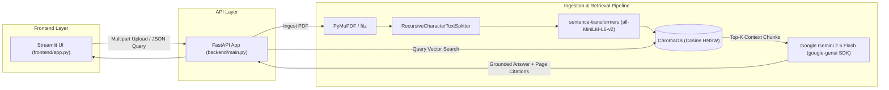

# RAG Document Intelligence

> Production-ready document intelligence system that extracts, vectors, and answers natural language questions over complex PDFs with zero-hallucination citations and exact page-level attribution.

[](LICENSE)
[](https://www.python.org/)
[](https://fastapi.tiangolo.com/)
[](https://streamlit.io/)
[](https://www.trychroma.com/)
[](https://ai.google.dev/)
[](https://pymupdf.readthedocs.io/)

---

## Overview

Traditional LLM document querying suffers from hallucinated claims and untraceable answers. **RAG Document Intelligence** pairs local semantic search with constrained LLM inference to guarantee answers are grounded strictly in your uploaded documents.

### Why This Architecture?
- **Zero-Hallucination Grounding**: Context is injected into Gemini 2.5 Flash via strict API-level `system_instruction` constraints. If the requested information is absent from the document, the model returns a deterministic fallback rather than guessing.
- **Verifiable Page Citations**: Every response includes precise page numbers, source document names, and cosine similarity confidence scores.
- **Local Embedding Vectorization**: Embeddings are computed locally using `sentence-transformers/all-MiniLM-L6-v2`—reducing API costs and latency during ingestion and retrieval.
- **Multi-Document & Collection Isolation**: Dynamic ChromaDB collection partitioning allows isolating documents per topic, research paper, or operational unit.

---

## Architecture & Data Flow



---

## Tech Stack

| Layer | Component | Purpose |
|---|---|---|
| **API Framework** | [FastAPI](https://fastapi.tiangolo.com/) | High-performance asynchronous REST endpoints with validation |
| **User Interface** | [Streamlit](https://streamlit.io/) | Interactive dual-pane web application |
| **PDF Extraction** | [PyMuPDF (fitz)](https://pymupdf.readthedocs.io/) | Fast, page-by-page non-empty text extraction |
| **Chunking** | [LangChain Splitters](https://python.langchain.com/) | `RecursiveCharacterTextSplitter` with configurable chunk/overlap sizes |
| **Embeddings** | [Sentence-Transformers](https://www.sbert.net/) | Local `all-MiniLM-L6-v2` dense vector representations (384 dims) |
| **Vector Database** | [ChromaDB](https://www.trychroma.com/) | Persistent vector store using HNSW with cosine distance |
| **LLM Generation** | [Google Gemini 2.5 Flash](https://ai.google.dev/) | Structured generation via the modern `google-genai` SDK |

---

## Project Structure

```text
.
├── backend/
│   ├── config.py       # Centralized environment & runtime configuration
│   ├── db.py           # Thread-safe ChromaDB PersistentClient singleton
│   ├── generator.py    # Gemini prompt synthesis with system instruction grounding
│   ├── ingest.py       # PDF parsing, recursive chunking, and vector persistence
│   ├── main.py         # FastAPI application with REST endpoints
│   └── retriever.py    # Semantic similarity search with cosine distance
├── frontend/
│   └── app.py          # Streamlit UI for document upload & querying
├── env.example         # Environment template
├── LICENSE             # MIT License
├── requirements.txt    # Production dependencies
└── README.md
```

---

## Quick Start

### 1. Prerequisites & Environment Setup

- Python 3.10+
- A Google AI Studio API Key ([Get a Gemini API Key](https://aistudio.google.com/app/apikey))

```bash
# Clone repository
git clone https://github.com/GurutejaReddy-04/rag-document-intelligence.git
cd rag-document-intelligence

# Create and activate virtual environment
python -m venv .venv
source .venv/bin/activate  # On Windows: .venv\Scripts\activate

# Install dependencies
pip install -r requirements.txt

# Configure environment variables
cp env.example .env
```

Edit your `.env` file and supply your Gemini API key:
```ini
GEMINI_API_KEY=your_gemini_api_key_here
GEMINI_MODEL=gemini-2.5-flash
CHROMA_PATH=chroma_db
UPLOAD_DIR=data/uploaded_docs
CHUNK_SIZE=500
CHUNK_OVERLAP=50
TOP_K_RESULTS=5
ALLOWED_ORIGINS=http://localhost:8501
API_URL=http://localhost:8000
```

---

### 2. Running the Backend (FastAPI)

Launch the backend API server from the `backend/` directory:

```bash
cd backend
uvicorn main:app --reload --host 0.0.0.0 --port 8000
```

The interactive OpenAPI/Swagger documentation will be available at:
- **Swagger UI**: [http://localhost:8000/docs](http://localhost:8000/docs)
- **Health Check**: [http://localhost:8000/health](http://localhost:8000/health)

---

### 3. Running the Frontend (Streamlit)

In a separate terminal window (with the virtual environment activated):

```bash
cd frontend
streamlit run app.py
```

Access the web interface at [http://localhost:8501](http://localhost:8501).

---

## API Reference

The FastAPI service exposes the following endpoints:

| Method | Endpoint | Description | Request Body / Parameters |
|---|---|---|---|
| `POST` | `/upload` | Ingest a PDF into a designated collection | `file` (multipart), `collection_name` (form), `force` (bool) |
| `POST` | `/query` | Retrieve context chunks and generate a cited response | `{"question": "string", "collection_name": "string"}` |
| `GET` | `/collections` | List all active ChromaDB collections | None |
| `DELETE` | `/collections/{name}` | Delete a collection and its embeddings | Path parameter: `name` |
| `POST` | `/reset` | Wipe all collections and reset vector database | Query param: `wipe_uploads` (bool) |
| `GET` | `/health` | Service liveness probe | None |

### cURL Examples

#### Ingest a PDF Document (`POST /upload`)
```bash
curl -X POST http://localhost:8000/upload \
  -F "file=@sample_report.pdf" \
  -F "collection_name=financial_reports" \
  -F "force=true"
```

#### Query Document with Natural Language (`POST /query`)
```bash
curl -X POST http://localhost:8000/query \
  -H "Content-Type: application/json" \
  -d '{
    "question": "What are the primary operational risks highlighted in the Q3 summary?",
    "collection_name": "financial_reports"
  }'
```

**Example Response:**
```json
{
  "answer": "The primary operational risks identified include supply chain bottlenecks and inflationary pressures on component pricing [Page 4, sample_report.pdf].",
  "sources": [
    {
      "page": 4,
      "source": "sample_report.pdf",
      "score": 0.2134
    }
  ]
}
```

#### List Available Collections (`GET /collections`)
```bash
curl -X GET http://localhost:8000/collections
```

---

## Configuration Options

| Parameter | Default | Description |
|---|---|---|
| `GEMINI_API_KEY` | *None* | **Required.** Google Gemini API authentication key |
| `GEMINI_MODEL` | `gemini-2.5-flash` | Gemini model variant used for generation |
| `CHROMA_PATH` | `chroma_db` | Disk directory for ChromaDB SQLite & HNSW index persistence |
| `UPLOAD_DIR` | `data/uploaded_docs` | Temporary directory for handling uploaded files |
| `CHUNK_SIZE` | `500` | Target character count per text chunk |
| `CHUNK_OVERLAP` | `50` | Character overlap between consecutive chunks |
| `TOP_K_RESULTS` | `5` | Number of context chunks retrieved for prompt synthesis |
| `ALLOWED_ORIGINS` | `http://localhost:8501` | Permitted CORS origins for the FastAPI server |
| `API_URL` | `http://localhost:8000` | Target backend URL utilized by the Streamlit application |

---

## Author & Maintainer

- **Author**: Guruteja Reddy Nallachi
- **GitHub**: [@GurutejaReddy-04](https://github.com/GurutejaReddy-04)

---

## License

This project is licensed under the MIT License - see the [LICENSE](LICENSE) file for details.
